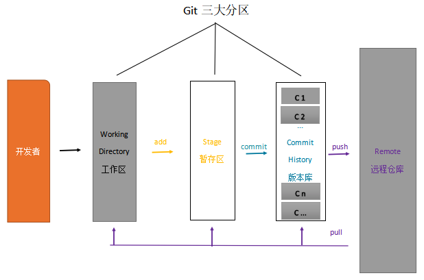

>

###  git仓库



```shell
git add .
git add file # 将file添加到暂存区，暂存区只是记录修改
git reset -- file / git rm --cached file # 撤销暂存区的修改，回到工作区
git diff # 查看工作区被追踪文件的修改情况
git diff -- cached # 查看暂存区的全部修改
git log #查看版本区的提交记录

git config --global user.email "853138468@qq.com"
git config --global user.name "starsEater"
git config -l / cat -n ~/.gitconfig

git commit -m "commit file" #  提交暂存区
git branch -avv # 产看全部分支信息 

git reset --soft HEAD^ # 撤销最近一次的提交，修改还原到暂存区
git reflog  # 查看版本
git reset --head HEAD@{1} # 回退到特定版本
```

